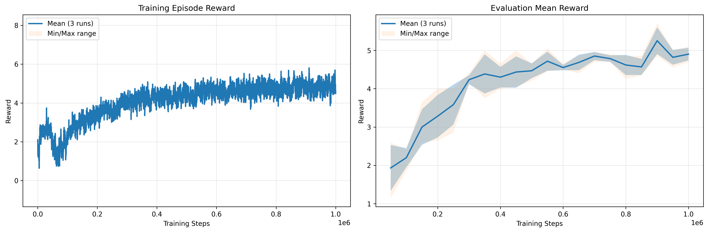
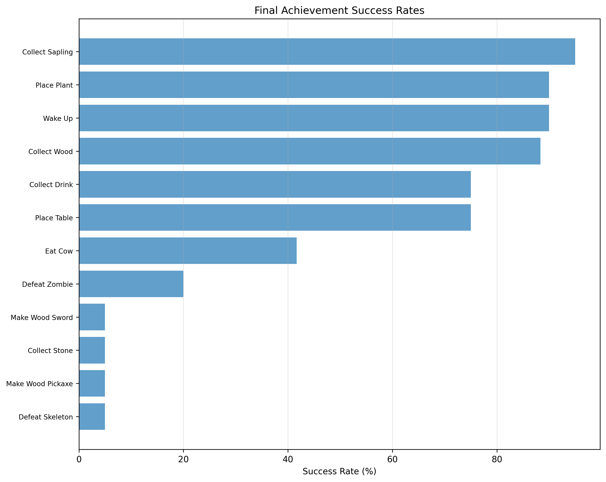
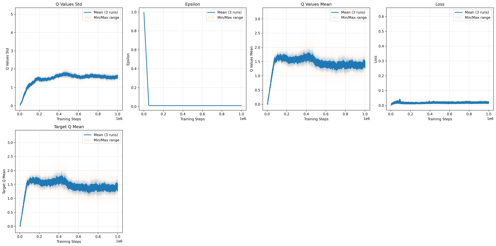

# Presentation Files - Quick Guide

## Files Created

1. **`presentation_slides.md`** - Complete slide deck in Markdown format
2. **`presentation_speaker_notes.md`** - Detailed speaker notes for each slide
3. This README - Instructions for converting to PDF

---

## Converting Markdown to PDF

### Option 1: Using Pandoc with Beamer (Recommended)

```bash
# Install pandoc if needed
sudo apt-get install pandoc texlive-latex-base texlive-latex-extra

# Convert to PDF
pandoc presentation_slides.md -t beamer -o presentation.pdf \
  --pdf-engine=xelatex \
  -V theme:Madrid \
  -V colortheme:default
```

### Option 2: Using Marp (Modern, Easy)

```bash
# Install Marp CLI
npm install -g @marp-team/marp-cli

# Convert to PDF
marp presentation_slides.md --pdf --allow-local-files
```

### Option 3: Using reveal-md (Web-based)

```bash
# Install reveal-md
npm install -g reveal-md

# Convert to PDF
reveal-md presentation_slides.md --print presentation.pdf
```

### Option 4: Online Converter (No Installation)

1. Go to https://www.markdowntopdf.com/
2. Upload `presentation_slides.md`
3. Download the PDF
4. **Note:** You'll need to insert plots manually

---

## Inserting Plots into Slides

### Plots You Need:

The slides reference these plot files - make sure they exist:

1. **Slide 6:** `logdir/enhanced-dqn/plots/rewards.png`
   - Average episodic reward (MANDATORY)

2. **Slide 7:** `logdir/enhanced-dqn/plots/achievement_spectrum.png`
   - Achievement spectrum (BONUS)

3. **Slide 8:** `logdir/enhanced-dqn/plots/training_metrics.png`
   - Loss and Q-values

### Checking Plots Exist:

```bash
# Verify all plots are present
ls -lh logdir/enhanced-dqn/plots/

# Should show:
# - rewards.png
# - achievement_spectrum.png
# - training_metrics.png
# - summary.png (not used in slides, but available)
```

### If Using Markdown with Images:

Replace the `[INSERT: ...]` placeholders with actual image syntax:

**Slide 6 (Line ~245):**
```markdown

```

**Slide 7 (Line ~265):**
```markdown

```

**Slide 8 (Line ~296):**
```markdown

```

### If Creating PDF Manually:

1. Convert Markdown to PDF using any method above
2. Open PDF in editor (Adobe Acrobat, PDFtk, etc.)
3. Insert images at the marked `[INSERT: ...]` locations
4. Save final PDF as `surname_name_middlename.pdf`

---

## Quick Start Guide

### 1. Verify Your Plots

```bash
cd /home/vi/remote-dev/uni/upb_atai_hw1_crafter
ls -lh logdir/enhanced-dqn/plots/
```

### 2. Edit Markdown with Your Names

Edit `presentation_slides.md`:
- Line 3: Replace `[Your Names Here]` with actual names
- Last slide: Add your email/contact info

### 3. Convert to PDF

Choose one method above and run the command.

### 4. Review PDF

Open the generated PDF and check:
- ✅ All formulas render correctly
- ✅ Tables are readable
- ✅ Page breaks are in good places
- ✅ Images appear if using relative paths
- ✅ No text is cut off

### 5. Insert Plots (if needed)

If plots didn't embed automatically, insert them manually.

### 6. Rename File

```bash
# Rename to assignment format
mv presentation.pdf surname_name_middlename.pdf
```

---

## Presentation Checklist

### Before Submission:
- [ ] PDF created and named correctly (`surname_name_middlename.pdf`)
- [ ] Your names on title slide
- [ ] All 3 mandatory plots present (rewards, achievement spectrum, training metrics)
- [ ] Random baseline comparison visible in plots
- [ ] All tables show `mean ± std` over 3 seeds
- [ ] Objective functions (mathematical formulas) clearly visible
- [ ] Emergent behaviors section included
- [ ] File size reasonable (<10 MB)

### Before Presentation:
- [ ] PDF opens correctly on your laptop
- [ ] Backup copy on USB drive
- [ ] Practice with timer (10-11 minutes)
- [ ] Read speaker notes at least once
- [ ] Prepare answers to common questions (see speaker notes)
- [ ] Know which slides to skip if running over time

---

## Slide Structure Summary

### Main Slides (11 total):
1. **Title & Introduction** (30 sec)
2. **Crafter Challenge** (1 min)
3. **Method & Algorithms** (2 min)
4. **Ablation Study** (1.5 min)
5. **Exploration Experiment** (1.5 min)
6. **Training Dynamics** (1.5 min) - MANDATORY PLOT
7. **Achievement Spectrum** (1.5 min) - BONUS PLOT
8. **Training Metrics** (1 min) - Can skip if over time
9. **Emergent Behaviors** (1 min)
10. **Conclusions** (1 min)
11. **Questions** (Q&A)

### Backup Slides (4 total):
- Complete results table
- Hyperparameter details
- Implementation details
- Related work comparison

**Total Time:** 10-11 minutes + Q&A

---

## Assignment Requirements Coverage

### ✅ Required (2.1.2.a): Method Description
- **Covered in:** Slide 3
- **Includes:** Objective functions, enhancements

### ✅ Required (2.1.2.b): Performance Plots
- **Average episodic reward (MANDATORY):** Slide 6
- **Loss & Q-values:** Slide 8
- **Random baseline comparison:** Slides 4, 5, 6
- **Achievement spectrum (BONUS):** Slide 7
- **2-3 seed average:** All results show 3 seeds

### ✅ Required (2.1.2.c): Emergent Behaviors
- **Covered in:** Slide 9

---

## Troubleshooting

### Problem: Formulas don't render
**Solution:** Use `pandoc` with `--pdf-engine=xelatex` or `--mathjax` flag

### Problem: Images don't appear
**Solution:** Use absolute paths or `--resource-path` flag:
```bash
pandoc presentation_slides.md -o presentation.pdf \
  --resource-path=.
```

### Problem: Tables overflow page
**Solution:** Use smaller font size or landscape orientation for slides with tables

### Problem: PDF too large
**Solution:** Compress images first:
```bash
# Optimize PNGs
for f in logdir/enhanced-dqn/plots/*.png; do
  convert "$f" -resize 1920x1080\> -quality 85 "$f"
done
```

### Problem: Text cut off on slides
**Solution:** Use `geometry` package with Pandoc:
```bash
pandoc presentation_slides.md -o presentation.pdf \
  -V geometry:margin=0.5in
```

---

## Tips for Good Slides

### Visual Design:
- **Keep it simple** - Don't overcrowd slides
- **Large fonts** - Minimum 20pt for body text
- **High contrast** - Dark text on light background
- **Consistent colors** - Use same colors throughout
- **Label axes** - Make plots self-explanatory

### Content:
- **One idea per slide** - Don't try to say everything
- **More slides, less text** - Better to have 15 simple slides than 10 dense ones
- **Emphasize key numbers** - Use bold, color, or size
- **Tell a story** - Each slide flows to the next

### Polish:
- **Spell check** - Run before converting
- **Consistent formatting** - Same heading levels, bullet styles
- **No orphans** - Don't split lists across slides
- **Test on projector** - If possible, test before presenting

---

## Quick Commands Reference

```bash
# Check plots exist
ls logdir/enhanced-dqn/plots/

# Edit slides
nano presentation_slides.md

# Convert to PDF (Pandoc)
pandoc presentation_slides.md -t beamer -o presentation.pdf

# Convert to PDF (Marp)
marp presentation_slides.md --pdf

# Check PDF
evince presentation.pdf

# Rename for submission
mv presentation.pdf surname_name_middlename.pdf

# Check file size
ls -lh surname_name_middlename.pdf
```

---

## Support

If you encounter issues:
1. Check the troubleshooting section above
2. Review the speaker notes for presentation tips
3. Test on a different PDF converter
4. Manually create slides in PowerPoint/Google Slides using the markdown as reference

---

Good luck with your presentation! 🎯
